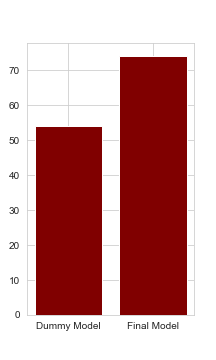

# Tazanian Well Project

#### Authors: Gideon

## Overview


Water is used in everything, for sanitation to ward off disease, to growing crops, it has been identified by the UN as one of the integral necessities for the development and sustaining of human life, in others words, no matter, no life.

That is why over 1000 organizations have been installing wells of all kinds here in Tanzania.  But once installed these wells require maintenance.  If they fail lives are on the line.


## Business Understanding


As shown here there are over  59,000 wells spread across all of Tazania’s 360,000 square miles.

If a well breaks and it requires parts we don’t have on hand already it could take 4 to 10 days to ship it from the US and 1-4 days if shipped express and 6-9 from even from Italy or Germany by air and even longer if shipped by boat.  More than the parts is the man power and equipment in position and on hand further we can know which wells to check more often.

This can save lots of vaulable time, the days it could take to repair a well could mean the difference between life and death.

However if we can get ourselves ahead of the curve. And anticipate a well’s likelihood to break ahead of the curve, if we can predict if the wells location, or  management group, or elevation could help us know in advance when the well might fail we can keep them running without losing precious time.

Thats where machine learning and modeling comes in.


## Data Understanding

The Data used in the analysis came from the Tanzanian government given to a Kaggle competition.  Its from 59,000 wells.


## Modeling

This is a classification problem, classfying something based on information we know about it.
In this case it is classiying a well as functioning, non functional, or needing repair.  

Using information about the well.  For example if the well was built by a certain installer, or funded by a certain partners (perhas suggesting requirements), managed in a certain way, located in a certain region could tell us something about how this well operates.  

A machine learning model will take this inroamtion and attempt to apply to various models in various ways to see in the data can provide any insight.


## Results





Through repeated iteration we found the a model that could identify the wells that would need maintenance with 74% correctness, we would like this to be alittle more detailed, and there were some holes in our approach we would like to fix if you would let us, we feel we owe it to you to get it right.  

This logisitic regression model was able to correctly classify a well as broken or not 74% of the time which is a large improvement over the 54% of the dummy model.  That said I know I can do better.

It was a bit shocking to me that half the wells were broken, I wanted to know  why, my first thought was maybe old wells are breaking, or newer wells become available and it was just cheaper to build new wells then update old ones, but that doesnt follow, nor does age, there were as many wells still working today from the 60s as there were wells broken from the 60s, likewise nearly a quarter of the wells built in 2011 were already broken.  So age and replacement could't be the only key factors

Now perhaps managment scheme matters.  When those items were considered they didn't yeild a much better model than just looking at subvillage.

From alittle exereince I had from a professor once who worked with these projects professionally I found that when a well is built _by_ the village the village knows how best to maintain them, when it is just given they don’t understand the well and don’t know how to repair it even when trained.  

We would recommend exploring alittle more.


## Conclusions

-Using our current model we can direct traffic towards high risk wells with greater accuracy than a blind guess but we wwould recommend allowing us to work more on this project and refine our approach
-It has been suggested that increasing villager patricaption in well construction increases the well’s longevity. It seems many wells have identical characteristics but opposite outcomes.  Wells from the 60s are operating side by side with modern wells.  Fro our approach we would conclude perhaps there is some aspect of the reality of a wells operational status that is not captured here.   

 This would stand with the seeming 50-50 odds of many of the models conclusions, seemingly identical wells were having a complete different operational status.  Villager training is not convered in the data.  It would be interesting to test the validatity of this proposal and see if villager involvement in construction is indicitive of a wells longevity.  

However, it is more likely that we haven’t done enough with the data yet and we would like to do that.

### Next Steps

We would like to explore more about the inferential side of the data to see which factors truly mattered most for example if height mattered.

If it becomes apparent that resident managment is the most important (something that subvillage’s importance in the model could indicate) then we would like to know that but we aren’t sure if thats the case here with our wells here.

## For More Information

## Repository Structure

```
├── data
├── images
├── README.md
├── EDA.ipynb
|-- WellsExploratoryNotebook.ipynb
```# WellProject
